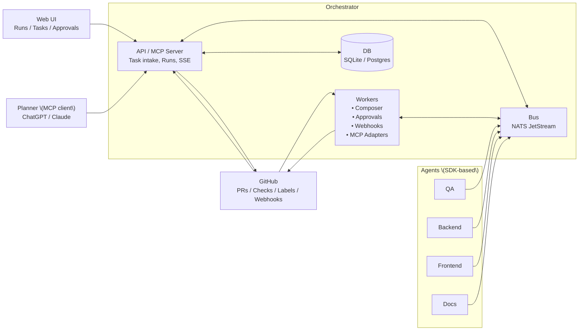
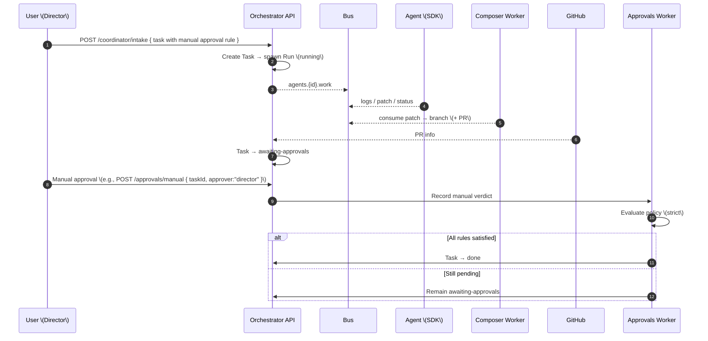

```mermaid
sequenceDiagram
  autonumber
  participant API as Orchestrator API
  participant GH as GitHub
  participant GATE as Approvals Worker
  participant U as User \(Director\)

  GH-->>GATE: Webhook: checks = failed
  GATE->>GATE: Evaluate → not satisfied
  GATE->>API: Task stays awaiting-approvals; annotate reason
  U->>API: Trigger fix \(new Task/Run\) or re-run checks/labels
  GH-->>GATE: Webhook: checks = success
  GATE->>GATE: Evaluate → satisfied
  GATE->>API: Task → done
```
